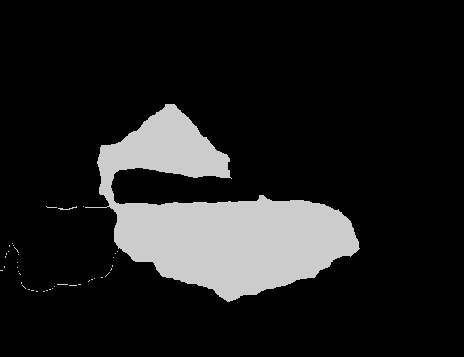

# Basic-image-segmentation-keras-with-kMean-clusters-as-pesented-by-Vidhya
kMean clusters from Vidhya used for final labeling of segments. This repository is based on the repository of Divam Gupta.

https://github.com/divamgupta/image-segmentation-keras

This repository is based on studying Divam Gupta's GitHub repository, blog and other written materials that we have found online. This is great work and a real help to a novice such as myself. 

The following is the original photo that we are working from found in "sample_images/1_input.jpg":

We use the pre-trained code provided by Divam to create our segmentation of this bedroom image using the python load_pretrain_and_create_image.py program driven with a command line from an xterm. 

  model = pspnet_50_ADE_20K() # in between detail - load the pretrained model trained on ADE20k dataset

  #model = pspnet_101_cityscapes() # too much detail - load the pretrained model trained on Cityscapes dataset

  #model = pspnet_101_voc12() # Just the People - load the pretrained model trained on Pascal VOC 2012 dataset

  #### model = load_model('vgg_unet_1.h5')

  # Use any of the 3 pretrained models above

  out = model.predict_segmentation(
      inp="sample_images/1_input.jpg",
      out_fname="bed_out.png"
  )

We then used the python program interactive_plots_clusters_with_box.py to created dscrete clusters using kMean as presented by Vidhya.

  kmeans = KMeans(n_clusters=20, random_state=0).fit(pic_n)
  pic2show = kmeans.cluster_centers_[kmeans.labels_]

The program is then used to discriminate the various predicted clusters and isolate on the segmented item that we are trying to isloate. 

We made our initial segmentation working with the the bedroom picture under the sample_images subdirectory (1_input.jpg). After discriminating all of the major features in the provided image as shown above, we then isolate the picture (bed) as our key feature, and then create a subsequent image showing just that feature with a green rectangle around it. 

We are working in Ubuntu and each python program is driven from an xterm command line using 'python xxxx.py' as the command. 

This second repository is similar to another Keras application repository found in this GitHub except that we are be using the kMean clusters to finalize our image segmentation process as presented by Vidhya. By using this kMean method we can reduce some noise found with just pixel value thresholds for the segmentation. sometimes the bed pixel values can also be found in the transitions from one segment to the next. kMean appears to reduce this noise. 

